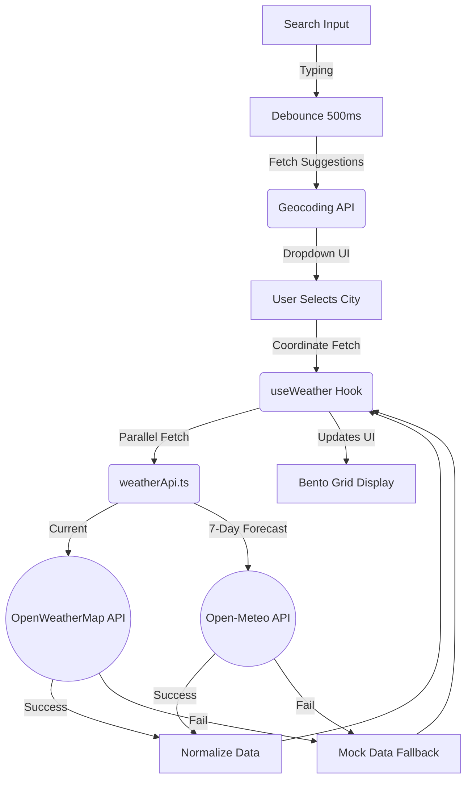
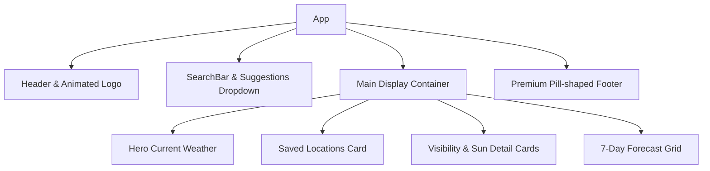

# System Architecture: Weather App

## 1. High-Level Overview
The SyntecXhub Weather App is a dynamic, data-driven application connecting to the OpenWeatherMap API. The architecture centers around an "Ambient Glass UI" concept where application state (weather conditions) directly drives the CSS environment via injected class styles.

## 2. Technology Stack
- **Core:** React 19, TypeScript 5.7
- **Bundler:** Vite 6.0
- **Styling:** Tailwind CSS v4 (Glassmorphism & Backdrops)
- **External Services:** OpenWeatherMap API (Current Weather), Geocoding API (City Suggestions), Open-Meteo API (7-Day Forecast)

## 3. Data Flow & Integration



## 4. Component Hierarchy


## 5. Architectural Highlights
- **High Availability Fetching**: Dual-API strategy using OpenWeatherMap for real-time accuracy and Open-Meteo for extended forecasting.
- **Mock Data Fallback**: Automatic failover to static weather datasets for 401/403 errors, ensuring 100% UI uptime during API propagation.
- **Persistence Layer**: Custom `useWeather` hook with `isFirstRender` protection to synchronize `savedLocations` with `localStorage`.
- **Bento Grid**: A custom CSS Grid system designed for high information density and responsive fluidity.
- **Debounce Logic**: 500ms buffer on Geocoding suggestions to prevent API rate-limiting during active typing.

## 6. File Structure
```text
/src
 ├── /api
 │   └── weatherApi.ts        # Direct integrations mapped to API params
 ├── /components              # Aesthetic UI renderings
 │   ├── CurrentWeatherCard.tsx    
 │   ├── ErrorMessage.tsx
 │   ├── ForecastGrid.tsx 
 │   ├── SearchBar.tsx
 │   └── WeatherSkeleton.tsx  # Async load placeholders
 ├── /hooks
 │   └── useWeather.ts        # Handles delays, Promise.allSettled
 ├── /types
 │   └── weather.types.ts     # OpenWeatherMap strict shapes
 ├── App.tsx                  # Layout and thematic wrapper
 ├── index.css                # Base visual theme tokens
 └── main.tsx                 # Bootstrapper
```

---
**Developer:** LSR Vidanaarachchi<br>
**Portfolio:** [lakidev.me](https://lakidev.me/)<br>
**GitHub:** [lakipop](https://github.com/lakipop)<br>

*Developed for the SyntecXhub Internship Program*